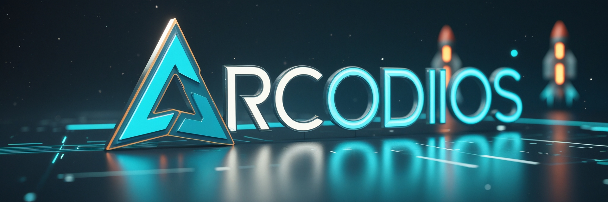

# 🧠 Arcodius OS – An AI-Native Operating System

---

## 🔷 Project Title:

**Arcodius OS – A Systems AI-Powered Operating System**

## 🔷 Vision Statement:

*Arcodius OS* is a next-generation operating system built from the ground up with **AI as a core component** — not as an application or tool, but as an **embedded, intelligent system entity**. The OS will dynamically adapt, optimize resources, automate user workflows, and learn over time, creating a seamless, proactive, and highly efficient user experience.

---

## 1. 🔍 Purpose & Significance

* Current operating systems treat AI as a plugin or application.  
* *Arcodius OS* proposes a **paradigm shift**, embedding **Systems AI into the OS kernel and shell** layers to enable:

  * Self-healing capabilities  
  * Context-aware personalization  
  * Predictive task management  
  * Smart automation of repetitive tasks  
  * Adaptive resource management  

---

## 2. 🧩 Core Components of Arcodius OS

| Layer                | AI Integration                                                                             |
| -------------------- | ------------------------------------------------------------------------------------------ |
| **Kernel Layer**      | Smart scheduling, memory optimization, process prediction, anomaly detection               |
| **System Services**   | Intelligent file access prediction, dynamic security management, resource allocation       |
| **User Interface**    | AI-powered assistant (voice + GUI), adaptive UI based on habits, accessibility enhancement |
| **Network Stack**     | AI-based firewall, bandwidth prediction, secure protocol optimization                      |
| **Developer APIs**    | Native AI APIs for apps to leverage OS-level intelligence                                  |
| **Self-Diagnostics**  | Logs analysis, behavior learning, auto-repair modules                                      |

---

## 3. 🏗️ Technology Stack

### Core Tech

* **Language:** Rust (kernel), C++ (system modules), Python (AI logic layer)  
* **AI Models:** LLMs (for assistant), RL (for scheduling), CNNs (for detection), transformers  
* **Frameworks:** ONNX, PyTorch, TensorFlow Lite  
* **Architecture:** Microkernel or Hybrid Kernel  
* **Package Management:** AI-curated dynamic package suggestions  
* **Security:** AI-assisted zero-day threat detection  

---

## 4. ⚙️ Functional Features

### 🌐 System-Level AI Capabilities

* **Smart Boot:** Boot-time prediction and configuration optimization.  
* **Process Intelligence:** Kill background tasks automatically that aren’t helping your productivity.  
* **Autonomous Updates:** Learn best times to update, roll back if anomalies occur.  

### 🧠 User-Centric AI Features

* **Behavior Analysis:** Understands routines to preload apps and documents.  
* **AI Companion:** Interacts naturally with the user via voice or chat, handles file organization, scheduling, reminders.  
* **Emotion-aware UI:** Changes theme/notifications based on tone detection (from voice or typing pattern).  

---

## 5. 🚀 Execution Plan (Phased Development)

### 📍 Phase 1: Foundation & Research (Month 1-2)

* Study kernel design (Linux / custom microkernel)  
* Evaluate best AI inference frameworks for edge performance  
* Build team structure: OS devs, AI engineers, UI/UX, testers  

### 📍 Phase 2: Base OS Development (Month 3-6)

* Create core kernel (possibly fork a microkernel for prototyping)  
* Build modular driver system  
* Basic shell and file system  
* Integrate voice command + rule-based AI for system interaction  

### 📍 Phase 3: AI Integration Layer (Month 6-9)

* Implement AI scheduler & task manager  
* Add predictive prefetch system  
* Design emotional/context-aware UI module  
* Build intelligent logging system for diagnostics  

### 📍 Phase 4: Adaptive Interface & Assistant (Month 10-12)

* Develop custom AI assistant (voice + chat)  
* Real-time natural language commands for file management, settings  
* AI learns user workflows and suggests actions proactively  

### 📍 Phase 5: Security & Optimization (Month 13-15)

* Integrate AI-driven firewall and anomaly detection  
* Refine model efficiency (lightweight models, quantization, pruning)  
* Prepare for multi-device support (desktop/laptop/tablet)  

### 📍 Phase 6: Alpha & Beta Testing (Month 16-18)

* Private alpha release → community feedback  
* Implement adaptive feedback system (learn from usage)  
* Optimize and fix bugs, finalize UI  

### 📍 Phase 7: Launch & Post-Launch Evolution (Month 19+)

* Public beta → Final release  
* Community-driven learning modules (user-contributed behavior models)  
* Continuous learning OS updates  

---

## 6. 📈 Potential Impact

### 🌍 For Daily Users

* Saves time with proactive file/app suggestions  
* Learns and adapts to your habits  
* Reduces energy consumption via intelligent resource control  
* Smooths multitasking with smart windowing/workspace switching  

### 🧑‍💻 For Developers

* Native AI API integration for custom app intelligence  
* AI-enhanced debugging, auto-logs, system usage insights  

### 🏢 For Enterprises

* Reduced IT maintenance with self-diagnosing, self-repairing OS  
* Enhanced security with AI-based threat detection  
* Performance optimization across multiple systems  

---

## 7. 🔒 Risks & Considerations

| Risk                                     | Mitigation                                               |
| ---------------------------------------- | -------------------------------------------------------- |
| **Privacy concerns**                      | Strict on-device processing, user data isolation         |
| **Model performance overhead**            | Use lightweight models, lazy loading, model distillation |
| **Security vulnerabilities in AI logic**  | Regular audits, adversarial testing                      |
| **Trust and transparency**                | Allow AI decision review logs, manual overrides          |

---

## 8. 🔮 Future Scope

* **Multi-Agent Systems:** Collaboration between different AI modules.  
* **Distributed Learning:** Sharing anonymized learning across devices.  
* **Neural Interface:** Integration with neural input systems for ultra-fast interaction.  
* **AI-Governed Virtual Machines:** Smart sandboxing and deployment automation.  

---

## 9. 📜 Conclusion

*Arcodius OS* is not just an operating system. It's a **living, learning digital entity** that evolves with you. By embedding Systems AI into the core of system interaction and operations, it will revolutionize how humans and machines work together in daily life.

---
